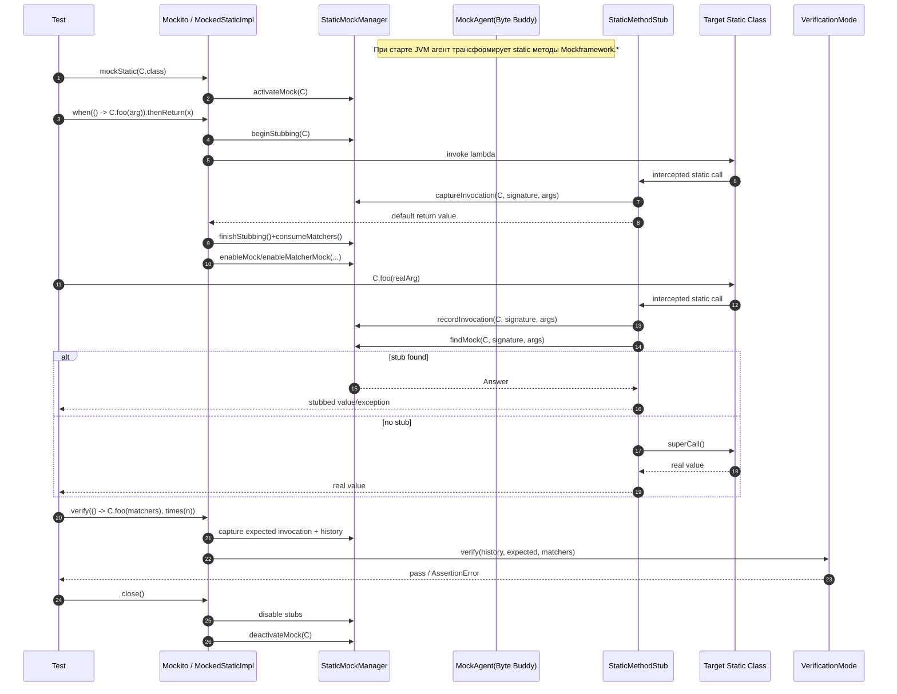

# Статические моки: как работает реализация

Документ описывает полный путь выполнения: от строки в тесте до внутренних компонентов.

## Что реализовано
- API: `mockStatic`, `when(...).thenReturn/thenThrow/thenAnswer`, `verify(...)`
- Режимы верификации: `times`, `never`, `atLeast`, `atMost`
- Матчеры аргументов: `any`, `eq`, `contains`
- История вызовов статических методов для `verify`
- Очистка состояния через `MockedStatic.close()` (обычно через `try-with-resources`)

## Где смотреть демо
- `examples/Mockframework/examples/StaticDemoTest.java` — демо только статического API

## Ключевые классы
- `Mockframework.Static.Mockito` — публичный API для создания и настройки статических моков
- `Mockframework.Static.staticmock.MockedStaticImpl` — основная логика `when/verify/close`
- `Mockframework.Static.staticmock.StaticMethodStub` — перехватчик каждого статического вызова
- `Mockframework.Static.staticmock.StaticMockManager` — хранилище стабов, матчеров, контекста и истории
- `Mockframework.Static.agent.MockAgent` — javaagent + Byte Buddy трансформация методов
- `Mockframework.Static.staticmock.InvocationSignatureResolver` — быстрый резолв сигнатуры no-arg method reference
- `Mockframework.Static.verification.*` — правила проверки количества вызовов

## Поток выполнения: от теста до реализации

### 1. Старт теста и подключение агента
При запуске `test` в Gradle JVM стартует с `-javaagent` (см. `build.gradle.kts`).

`MockAgent.premain(...)`:
- включает `AgentBuilder` с `RETRANSFORMATION`
- отбирает классы `Mockframework.*`
- исключает `java.*`, `jdk.*`, `sun.*`, `Mockframework.Static.*` служебные пакеты, а также `Mockframework.Dynamic.*`
- перехватывает все статические, не-native, не-`<clinit>` методы
- делегирует вызов в `StaticMethodStub.intercept(...)`

Итог: каждый статический метод целевых классов проходит через общий перехватчик.

### 2. `Mockito.mockStatic(SomeClass.class)`
В тесте вызывается:
```java
try (MockedStatic<SomeClass> mocked = Mockito.mockStatic(SomeClass.class)) { ... }
```

Что происходит:
- `Mockito.mockStatic(...)` валидирует класс
- запрещает мокать `java.*`, `jdk.*`, `sun.*`
- создает `MockedStaticImpl<T>`
- в конструкторе `MockedStaticImpl` вызывается `StaticMockManager.activateMock(clazz)`

`activateMock`:
- повышает счетчик активных моков для класса в `ThreadLocal`
- если это первый активный мок класса в текущем потоке, очищает историю вызовов этого класса

### 3. Настройка стаба: `mocked.when(...).then...`

#### 3.1 Вход в `when(...)`
`MockedStaticImpl.when(...)`:
- проверяет, что мок не закрыт
- принимает лямбду `StaticInvocation<R>`

Два варианта пути:

- Быстрый путь no-arg method reference:
  - `InvocationSignatureResolver.resolve(...)` пытается извлечь `SerializedLambda`
  - если это `REF_invokeStatic` и метод без аргументов, сигнатура строится без реального вызова метода
  - дополнительно проверяется, что не были зарегистрированы матчеры для no-arg

- Общий путь:
  - `StaticMockManager.beginStubbing(expectedClass)`
  - выполняется `invocation.invoke()`
  - фактический вызов будет перехвачен `StaticMethodStub` и записан через `captureInvocation(...)`
  - `finishStubbing()` возвращает `CapturedInvocation`
  - `consumeMatchers()` забирает зарегистрированные матчеры
  - валидируется соответствие числа матчеров числу аргументов

#### 3.2 `thenReturn/thenThrow/thenAnswer`
`OngoingStubbingImpl` внутри `MockedStaticImpl`:
- накапливает ответы в `answers`
- если ответ один, использует его напрямую
- если ответов несколько, использует `ChainedStaticAnswer`
  - 1-й вызов -> 1-й ответ
  - 2-й вызов -> 2-й ответ
  - после конца цепочки повторяется последний ответ

Регистрация:
- без матчеров: `StaticMockManager.enableMock(clazz, signature, args, answer)` (точный ключ)
- с матчерами: `enableMatcherMock(...)` (паттерн + answer)
- запись сохраняется в `registeredAnswers` для корректного `close()`

### 4. Реальный вызов статического метода в коде под тестом
Когда код вызывает `SomeClass.someStatic(...)`, срабатывает `StaticMethodStub.intercept(...)`.

Порядок в `intercept`:
1. Строится строковая сигнатура метода (например, `greet(java.lang.String)`).
2. Если идет stubbing/verify capture (`isStubbingInProgress()`):
   - `captureInvocation(...)`
   - вернуть default-значение для типа (чтобы не дергать реальную логику)
3. Иначе:
   - `recordInvocation(...)` пишет событие в историю, но только если мок класса активен
   - `findMock(...)` ищет стаб:
     - сначала точное совпадение аргументов
     - потом matcher-стабы в обратном порядке (последний зарегистрированный имеет приоритет)
   - если стаб найден -> вернуть его результат
   - если стаб не найден -> вызвать оригинальный метод через `superCall`

### 5. Верификация: `mocked.verify(...)`
`MockedStaticImpl.verify(...)` по структуре похож на `when(...)`:
- по умолчанию использует `Times(1)`
- захватывает ожидаемый вызов (через быстрый no-arg путь или через `beginStubbing/invoke/finishStubbing`)
- собирает матчеры
- берет историю: `StaticMockManager.getInvocationHistory(clazz)`
- передает данные в `VerificationMode.verify(...)`

Пример `Times.verify(...)`:
- фильтрует историю по:
  - классу
  - сигнатуре метода
  - либо точному совпадению аргументов, либо matcher-предикатам
- сравнивает фактическое количество с ожидаемым
- при расхождении бросает `AssertionError`

`AtLeast` и `AtMost` используют тот же matching, но другое условие сравнения счетчика.

### 6. Завершение: `close()`
При выходе из `try-with-resources` вызывается `MockedStaticImpl.close()`:
- для каждого зарегистрированного ответа удаляет стаб из `StaticMockManager`
- очищает `registeredAnswers`
- ставит флаг `closed=true`
- вызывает `deactivateMock(clazz)`

`deactivateMock`:
- уменьшает счетчик активных моков класса
- при переходе к нулю очищает историю вызовов класса для текущего потока

## Thread model и изоляция
- Все ключевые структуры в `StaticMockManager` хранятся в `ThreadLocal`
- Стабы и история не текут между потоками
- Это поведение покрыто тестами на thread-local изоляцию

## Mermaid диаграмма


## Ограничения и важные правила
- Мокируются только классы из `Mockframework.*` (см. фильтр в агенте)
- `java.*`, `jdk.*`, `sun.*` мокать нельзя
- В одном `when(...)`/`verify(...)` поддерживается только один статический вызов
- Количество матчеров должно совпадать с количеством аргументов метода
- Для matcher-стабов приоритет у последнего зарегистрированного совпадения
